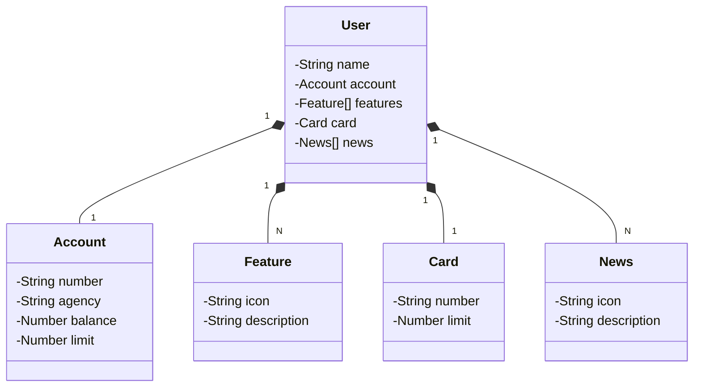

# Santander Bootcamp 2023
Java RESTful API.

## Diagrama de Classes

🔗 [Clique aqui para acessar]([https://anahaubert.github.io/SNAKE-GAME/](https://santanderbootcamp2023-prd.up.railway.app/swagger-ui/index.html)https://santanderbootcamp2023-prd.up.railway.app/swagger-ui/index.html)
